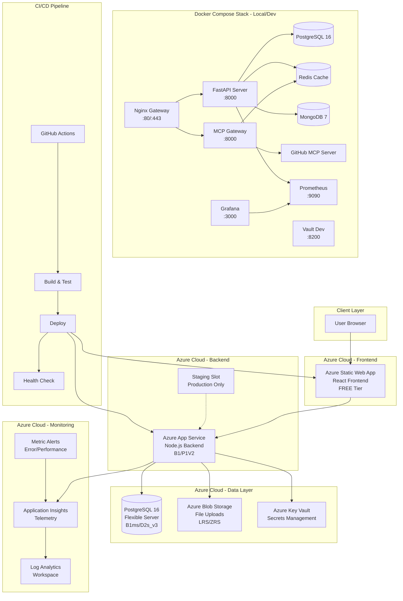
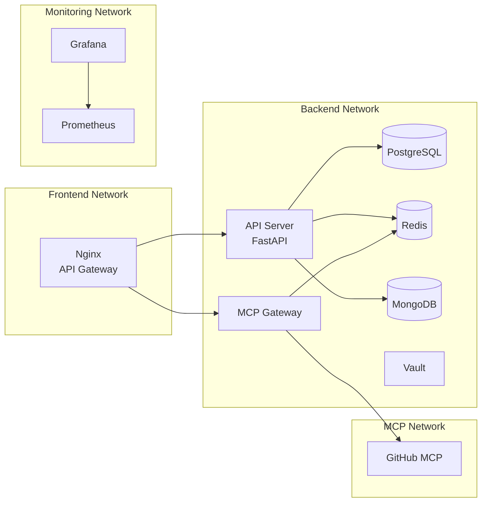
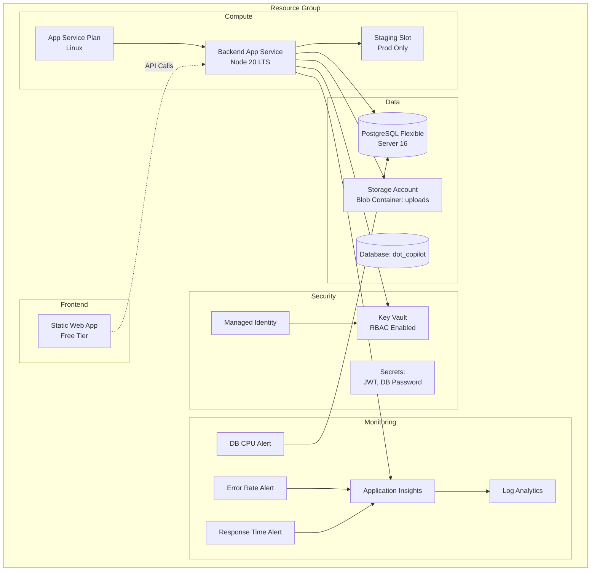
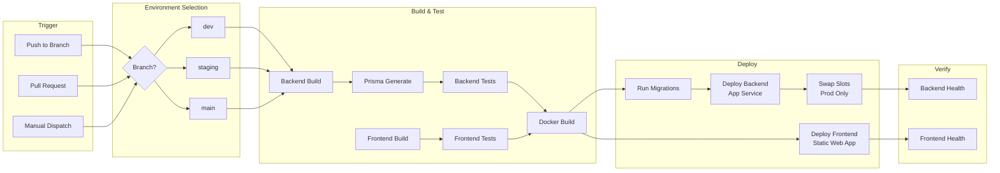
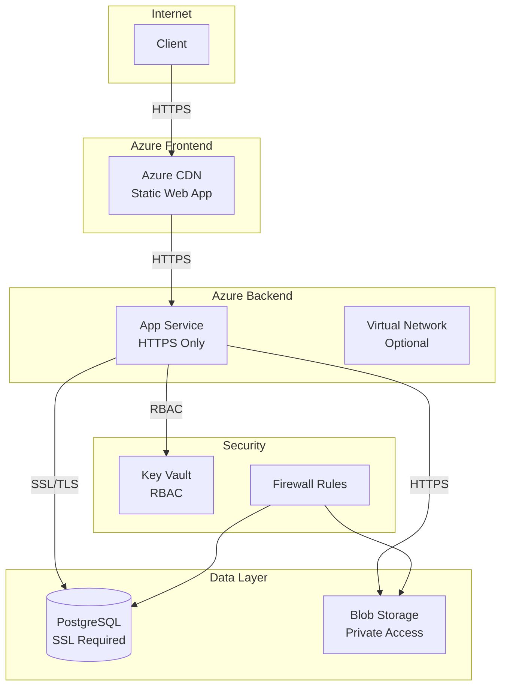
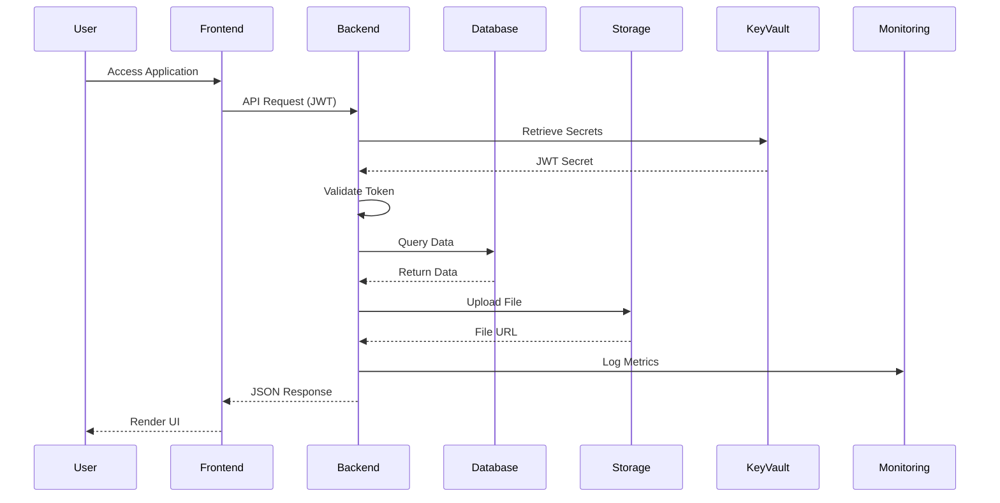
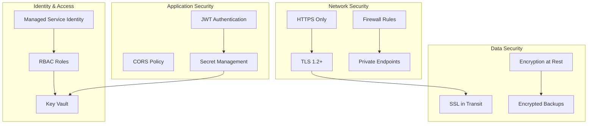
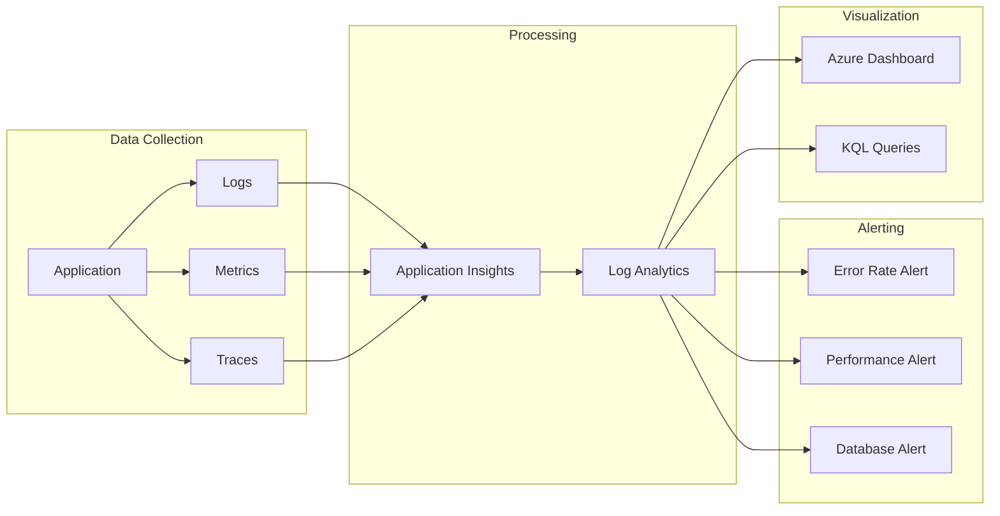
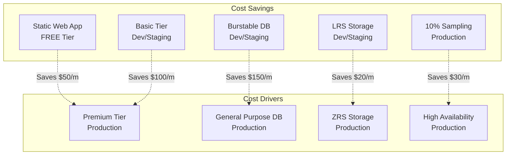

# DOT-Copilot Infrastructure Architecture

## System Architecture Overview



## Docker Compose Architecture (Development)



## Azure Infrastructure Components



## CI/CD Pipeline Flow



## Network Architecture



## Data Flow



## Environment Tiers

| Component | Dev | Staging | Production |
|-----------|-----|---------|------------|
| **App Service Plan** | B1 Basic | B1 Basic | P1V2 Premium |
| **PostgreSQL** | B1ms Burstable | B1ms Burstable | D2s_v3 General Purpose |
| **Storage** | LRS | LRS | ZRS |
| **High Availability** | Disabled | Disabled | Zone Redundant |
| **Backup Retention** | 7 days | 7 days | 14 days |
| **Geo Redundancy** | Disabled | Disabled | Enabled |
| **Staging Slot** | No | No | Yes |
| **Always On** | No | No | Yes |
| **Estimated Cost** | ~$30/mo | ~$35/mo | ~$250/mo |

## Security Architecture



## Monitoring & Observability



## Deployment Strategies

### Blue-Green Deployment (Production)

```mermaid
graph LR
    subgraph "Production Slot"
        BLUE[Current Version<br/>v1.0]
    end

    subgraph "Staging Slot"
        GREEN[New Version<br/>v1.1]
    end

    subgraph "Traffic"
        USERS[Users]
        LB[Load Balancer]
    end

    USERS --> LB
    LB -->|100%| BLUE
    GREEN -.Deploy & Test.-> GREEN
    GREEN -.Swap.-> BLUE
    LB -.Switch.->|100%| GREEN
```

## Cost Optimization


