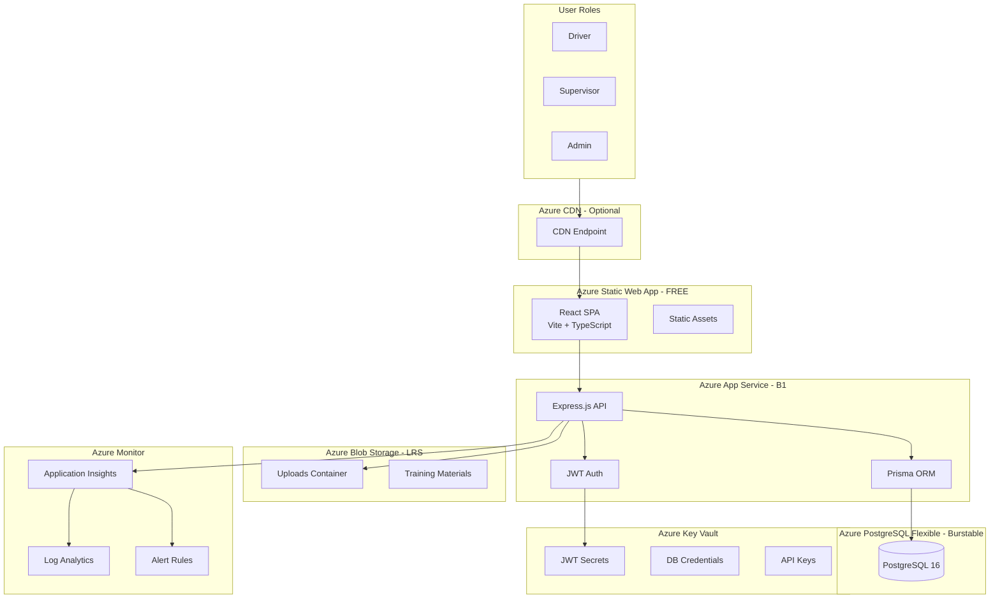
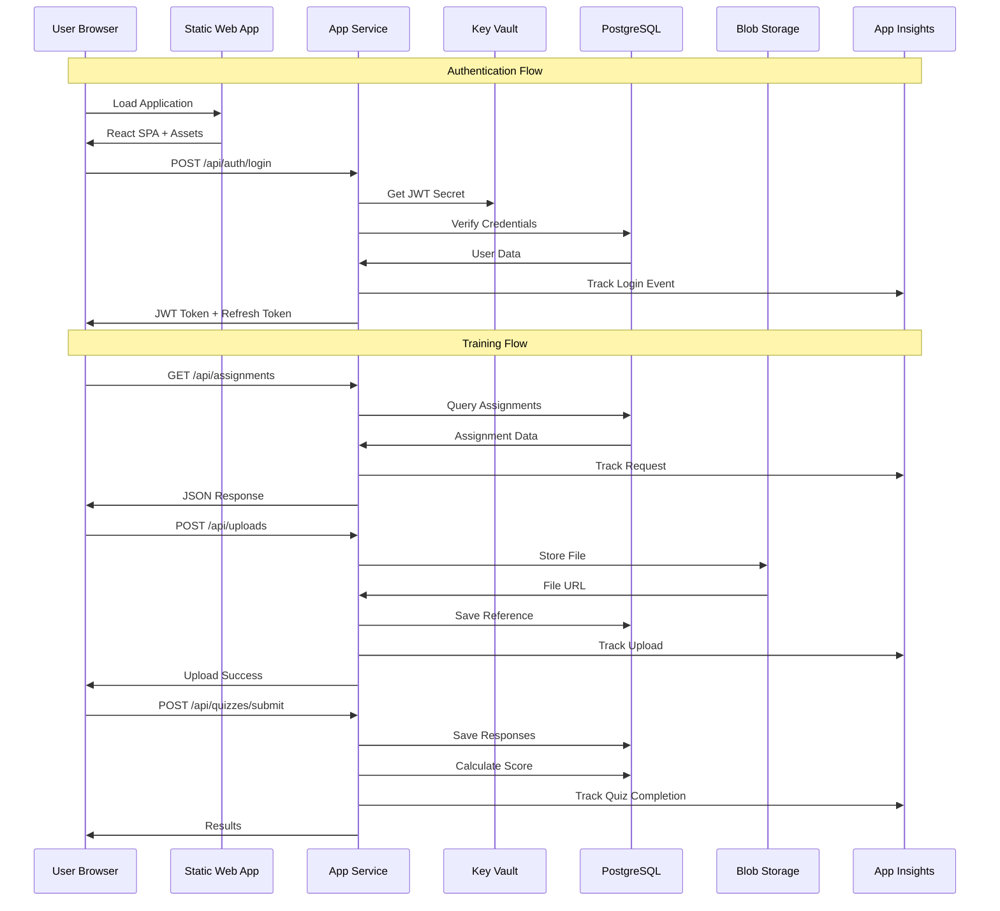
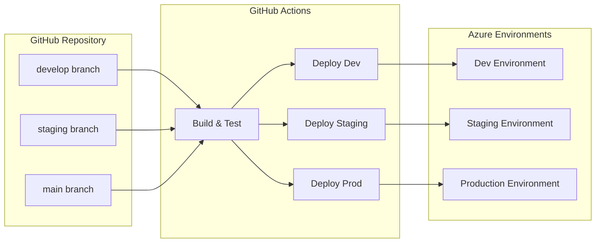
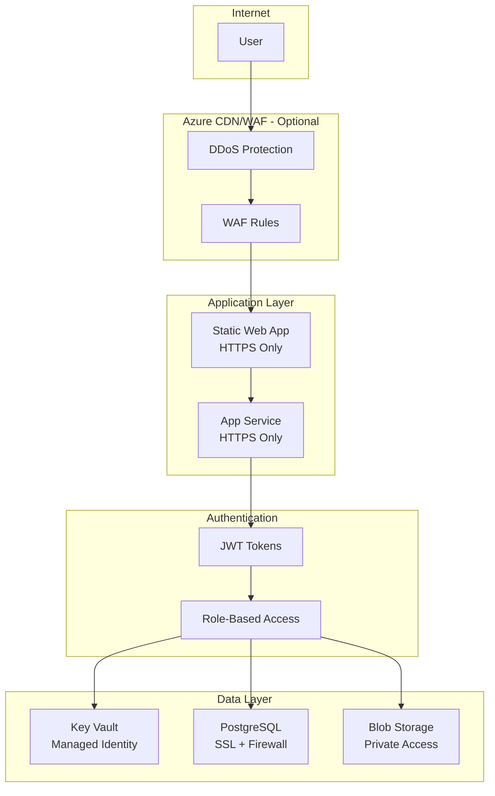

# DOT Copilot - System Architecture

## Overview

DOT Copilot is a driver training management system built for cost-effective Azure deployment.

## System Architecture Diagram

## Data Flow

## Cost Breakdown

### Development Environment (~$30/month)

| Resource | SKU | Monthly Cost |
|----------|-----|--------------|
| Static Web App | Free | $0 |
| App Service Plan | Basic B1 | $13 |
| PostgreSQL Flexible | Burstable B1ms | $12 |
| Blob Storage | Standard LRS (50GB) | $2 |
| Key Vault | Standard | $0.03 |
| Application Insights | Free tier (5GB) | $0 |
| **Total** | | **~$27** |

### Production Environment (~$250/month)

| Resource | SKU | Monthly Cost |
|----------|-----|--------------|
| Static Web App | Free | $0 |
| App Service Plan | PremiumV2 P1V2 | $73 |
| PostgreSQL Flexible | GP D2s_v3 | $145 |
| Blob Storage | Standard ZRS (100GB) | $4 |
| Key Vault | Standard | $1 |
| Application Insights | Pay-as-you-go | $25 |
| **Total** | | **~$248** |

### Cost Optimization Tips

1. **Use Reserved Instances** (1-3 year commitment)
   - App Service: Up to 40% savings
   - PostgreSQL: Up to 50% savings

2. **Application Insights Sampling**
   - Set 10% sampling in production
   - Full data for errors only

3. **Auto-stop Development**
   - Stop non-production databases overnight
   - Use Azure Automation runbooks

4. **Right-size Resources**
   - Start with Burstable DB, upgrade if needed
   - Monitor actual usage before scaling

## Component Details

### Frontend (Azure Static Web App)

- **Framework**: React 18 + TypeScript
- **Build**: Vite
- **State Management**: Zustand
- **Styling**: CSS Modules
- **Testing**: Vitest + React Testing Library

Benefits of Static Web App:
- Free tier with global CDN
- Automatic SSL certificates
- Preview environments for PRs
- Built-in authentication options

### Backend (Azure App Service)

- **Framework**: Express.js + TypeScript
- **ORM**: Prisma
- **Authentication**: JWT with refresh tokens
- **Validation**: Zod schemas
- **Documentation**: Swagger/OpenAPI

### Database (PostgreSQL Flexible Server)

- **Version**: PostgreSQL 16
- **Features**:
  - Automatic backups (7-14 days)
  - Point-in-time restore
  - SSL enforcement
  - Connection pooling (PgBouncer)

### Storage (Azure Blob Storage)

- **Structure**:
  - `/uploads` - User file uploads
  - `/training` - Training materials (PDFs, videos)
  - `/exports` - Generated reports

### Security (Key Vault)

- **Secrets Stored**:
  - JWT signing secrets
  - Database credentials
  - API keys for external services
  - SMTP credentials

### Monitoring (Application Insights)

- **Tracked Metrics**:
  - Request rates and response times
  - Error rates (4xx, 5xx)
  - Database query performance
  - Custom business metrics

- **Alerts Configured**:
  - High response time (>2s)
  - Server errors (>10 in 15min)
  - Database CPU (>80%)
  - Health check failures

## Deployment Architecture

## Security Architecture

## Scaling Strategy

### Horizontal Scaling

1. **App Service Scale-out**
   - Configure auto-scale rules based on CPU/memory
   - Min: 1 instance, Max: 10 instances
   - Scale at 70% CPU for 5 minutes

2. **Database Read Replicas**
   - Add read replicas for reporting queries
   - Route read traffic to replicas

### Vertical Scaling

1. **App Service**
   - B1 → B2 → B3 → P1V2 → P2V2
   
2. **PostgreSQL**
   - B1ms → B2s → D2s_v3 → D4s_v3

## Disaster Recovery

- **RTO (Recovery Time Objective)**: 4 hours
- **RPO (Recovery Point Objective)**: 1 hour

### Backup Strategy

1. **Database**: 
   - Automatic daily backups (14 days retention in prod)
   - Point-in-time restore capability
   - Geo-redundant backups in production

2. **Blob Storage**:
   - Soft delete enabled (7 days)
   - Versioning enabled
   - ZRS redundancy in production

3. **Configuration**:
   - Infrastructure as Code (Bicep)
   - All secrets in Key Vault
   - GitHub Actions for reproducible deployments

